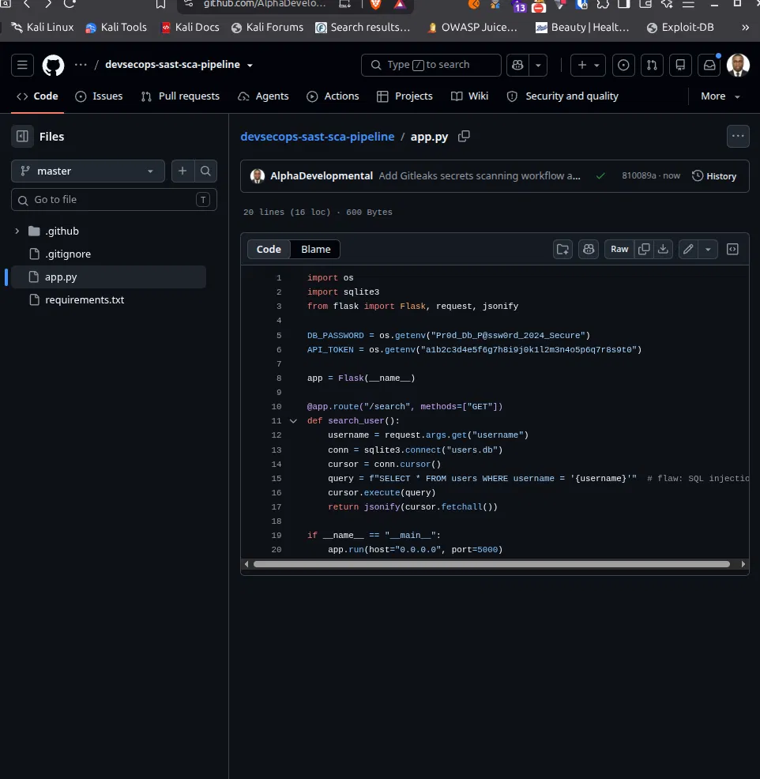

# DevSecOps Security Gate Pipeline

[](https://github.com/AlphaDevelopmental/devsecops-sast-sca-pipeline/actions)

A CI/CD security gate implementing Shift-Left Security on GitHub Actions. Enforces three automated, blocking security controls — Secrets Detection, Static Application Security Testing (SAST), and Software Composition Analysis (SCA) — on every push, with parallel job execution, least-privilege token permissions, and SHA-pinned Actions to mitigate supply-chain risk.

Each control is demonstrated as a functioning gate: a deliberately vulnerable Flask application is scanned, the pipeline fails on real findings (CVE-2023-30861, CWE-89 SQL Injection, exposed credential), the code is remediated, and the same pipeline passes clean — with the full run history preserved as evidence.

| | |
|---|---|
| **Target application** | Python 3.10 / Flask |
| **CI/CD** | GitHub Actions |
| **Secrets detection** | Gitleaks |
| **SAST** | Semgrep (`p/security-audit`, `p/owasp-top-ten`) |
| **SCA** | Trivy (filesystem scan, pip) |
| **Author** | Taiwo Micheal Glass — AlphaDevelopmental Technologies |
| **Links** | [github.com/AlphaDevelopmental](https://github.com/AlphaDevelopmental) · [alphadevelopmental.github.io](https://alphadevelopmental.github.io) |

---

## Architecture

### Design principles

- **Fail-fast staging** — cheapest, most urgent check (secrets) runs first; both downstream jobs depend on it passing before consuming compute.
- **Parallel execution** — SAST and SCA run concurrently once secrets-scan passes, minimizing total pipeline duration.
- **Least privilege** — `permissions: contents: read` at workflow level; no job is granted write access it doesn't need.
- **Supply-chain integrity** — every third-party Action is pinned to a full 40-character commit SHA, not a mutable version tag, preventing silent upstream compromise.
- **Hard gates, not reports** — every scanner runs with a blocking exit code (`--error`, `exit-code: 1`). A finding above threshold fails the build; nothing merges silently.

### Pipeline flow

```
                    ┌───────────────────┐
                    │   git push        │
                    │   (branch: master)│
                    └─────────┬─────────┘
                              │
                              ▼
                ┌─────────────────────────┐
                │  secrets-scan           │
                │  Gitleaks               │
                │  (full git history)     │
                └────────────┬────────────┘
                              │ needs: secrets-scan
                 ┌────────────┴────────────┐
                 ▼                         ▼
      ┌─────────────────────┐   ┌─────────────────────┐
      │  sast-scan          │   │  sca-scan           │
      │  Semgrep             │   │  Trivy (fs, pip)    │
      │  security-audit +    │   │  severity: HIGH,    │
      │  owasp-top-ten       │   │  CRITICAL           │
      └───────────┬─────────┘   └───────────┬─────────┘
                  │                          │
                  └───────────┬──────────────┘
                              ▼
                  ┌───────────────────────┐
                  │  All gates pass?       │
                  ├── NO  ──► Build fails, │
                  │           merge blocked│
                  └── YES ──► Build passes │
                  └───────────────────────┘
```

### Job dependency table

| Job | Depends on | Runs in parallel with | Blocking? |
|---|---|---|---|
| `secrets-scan` | — | — | Yes |
| `sast-scan` | `secrets-scan` | `sca-scan` | Yes |
| `sca-scan` | `secrets-scan` | `sast-scan` | Yes |

---

## Findings & Remediation

Each control below was verified against a genuine, seeded vulnerability — not a synthetic test. The build failed on first detection and passed only after real code remediation.

### 1. Secrets Detection — Gitleaks

| | |
|---|---|
| **Rule** | `generic-api-key` |
| **Location** | `app.py`, line 5 |
| **Finding** | Hardcoded API token committed to source |
| **Risk** | Credential exposure — anyone with repo read access (or a repo leak) gains a live-looking secret; in a real deployment this could mean account or resource compromise |
| **Remediation** | Externalized via `os.getenv()`; secret now sourced from environment at runtime, never committed |
| **Evidence** | Run #2 (red) → Run #3 (green) |

### 2. SAST — Semgrep

| | |
|---|---|
| **Rules** | `python.django.security.injection.sql.sql-injection-using-db-cursor-execute`, `python.flask.security.injection.tainted-sql-string` |
| **CWE** | CWE-89 — SQL Injection |
| **Location** | `app.py`, line 15 |
| **Finding** | User-controlled `username` parameter concatenated directly into a raw SQL string |
| **Risk** | Unauthenticated SQL injection — an attacker could manipulate the query to read, modify, or exfiltrate arbitrary data from the `users` table |
| **Remediation** | Replaced with a parameterized query (`cursor.execute(query, (username,))`), letting the DB driver treat input strictly as data |
| **Evidence** | Run #7 (red) → Run #8 (green) |

### 3. SCA — Trivy

| | |
|---|---|
| **CVE** | CVE-2023-30861 |
| **Severity** | HIGH |
| **Package** | `flask==1.1.2` |
| **Finding** | Missing `Vary: Cookie` header can cause the permanent session cookie to be cached and served to a different user under certain caching configurations |
| **Risk** | Session disclosure — one user's authenticated session could leak to another |
| **Remediation** | Upgraded to `flask==2.3.2` (patched release) |
| **Evidence** | Run #10 (red) → Run #11 (green) |

### Ruleset iteration note

The initial Semgrep run used the lightweight `p/ci` ruleset, which did **not** catch the seeded SQL injection — it only flagged unrelated findings (mutable Action tags, Flask host binding). Switching to `p/security-audit` + `p/owasp-top-ten` (225 rules vs. 32) surfaced the actual SQLi. This is documented deliberately: no single ruleset is exhaustive, and ruleset selection is itself a security decision.

---

## Threat Model

### In scope — what this pipeline defends against

| Threat | Control | Stage |
|---|---|---|
| Hardcoded credentials committed to source or history | Gitleaks, full-history scan | `secrets-scan` |
| Insecure code patterns (SQL injection, unsafe host binding) | Semgrep, security-audit + OWASP Top 10 rulesets | `sast-scan` |
| Known-vulnerable third-party dependencies | Trivy, pip manifest scan against NVD-backed DB | `sca-scan` |
| CI/CD supply-chain compromise via mutable Action references | SHA-pinned Actions | All jobs |
| Broad/unnecessary workflow permissions | `permissions: contents: read` | Workflow level |

### Out of scope — explicit limitations

- **No DAST (Dynamic Application Security Testing)** — the application is never run and probed live; only static analysis and dependency scanning are performed. Runtime-only issues (auth bypass under load, business-logic flaws) are not covered.
- **No container/image scanning** — this pipeline scans the filesystem (`fs` mode), not a built Docker image. A future iteration should add `trivy image` scanning if containerization is introduced.
- **No infrastructure-as-code scanning** — no Terraform/IaC exists in this project yet; tools like `tfsec`/`checkov` would be needed if that's added.
- **Ruleset coverage is not exhaustive** — Semgrep's community rulesets catch common, well-known patterns; a determined attacker using unusual code constructs could evade static pattern matching. SAST is a gate, not a guarantee.
- **Trivy's DB reflects known CVEs at scan time** — a zero-day or freshly disclosed vulnerability in a dependency won't be caught until the DB updates.
- **No secrets rotation** — Gitleaks detects committed secrets; it does not rotate or revoke a credential once found. That remains a manual/operational step.
- **Single-branch pipeline** — currently triggers on `master` only; no branch protection rules or required-status-check enforcement configured yet at the repository settings level.

---

## How to Run / Reproduce

### Prerequisites
- Python 3.10+
- Git
- A GitHub account (to fork/push and trigger Actions)

### Local setup

```bash
git clone https://github.com/AlphaDevelopmental/devsecops-sast-sca-pipeline.git
cd devsecops-sast-sca-pipeline
pip install -r requirements.txt
python app.py
```

The app runs on `http://127.0.0.1:5000`. Example endpoint:
```
GET /search?username=admin
```

### Running the security gates locally (before pushing)

```bash
# Secrets scan
gitleaks detect --source . --verbose

# SAST
pip install semgrep
semgrep scan --config p/security-audit --config p/owasp-top-ten --error

# SCA
trivy fs . --severity HIGH,CRITICAL --exit-code 1
```

### Triggering the CI pipeline

The pipeline runs automatically on every `push` or `pull_request` to `master`. To see it in action:

```bash
git add .
git commit -m "your message"
git push origin master
```

Then check the **Actions** tab of the repository for job-by-job results.

---

## Evidence

Screenshots of each gate's red (failing) → green (passing) transition are stored in `/screenshot`.

| Stage | Red Build | Green Build |
|---|---|---|
| Secrets Detection | Run #2 — `generic-api-key` detected | Run #3 — No leaks detected |
| SAST | Run #7 — 2 blocking SQLi findings | Run #8 — Clean scan |
| SCA | Run #10 — CVE-2023-30861 (HIGH) | Run #11 — Clean scan |

Full run history: [Actions tab](https://github.com/AlphaDevelopmental/devsecops-sast-sca-pipeline/actions)




---

**AlphaDevelopmental Technologies** · Build · Break · Secure
[github.com/AlphaDevelopmental](https://github.com/AlphaDevelopmental) · [alphadevelopmental.github.io](https://alphadevelopmental.github.io)